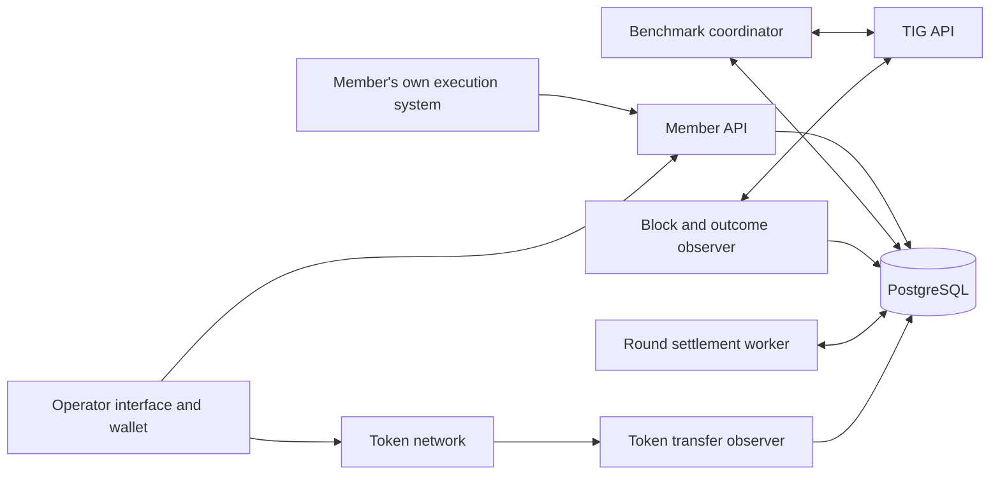

# InnoPool redesign and implementation plan

Prepared 20 September 2026. Scope: a fresh deployment of the pool and its member interface, developed in separate forks of `tig-pool` and `innopool-slave`. This document specifies the implementation; current progress is recorded in [IMPLEMENTATION_STATUS.md](IMPLEMENTATION_STATUS.md). The new system is not enabled and no funds have been moved.

## 1. Intended result

Members request an entire benchmark when they have available CPU or GPU compute. The pool chooses the work, reserves the member's collateral, submits through its own TIG account, and assigns the resulting benchmark exclusively to that member. Each member has an operator-controlled collateral multiplier from 0 to 1; it scales the normal collateral requirement for new benchmarks only. Existing reservations retain their original multiplier and amount. Members manage execution across their own machines. Each member can have at most two unfinished benchmark assignments across CPU and GPU combined.

The pool holds deposited TIG and received earnings in one wallet while recording each member's balance separately. Completing a benchmark frees its execution slot once TIG makes it active, but collateral remains locked until the relevant arbitration period has finished. Failed benchmarks also free their slots while keeping collateral reserved for settlement.

For round X, the pool records each member's qualifying bundles at every block. After round X+2 ends and outcomes are known, the pool combines its final net TIG earnings for X with collateral forfeited for X. When members have qualifying credit, it takes a 5% operator fee and distributes the remaining 95% according to their cumulative qualifying-bundle counts during X. If total member qualifying credit is zero, the entire final round pot goes to the operator. Spendable earnings are credited only when the corresponding funds have actually been received. Withdrawals require operator review and an operator-sent transfer. The pool pays benchmark submission costs and withdrawal transaction fees from its own funds or operator share, without additional charges to members.

The existing Python, FastAPI, PostgreSQL, Docker, website, protocol serialization, and verification components provide a useful foundation. The scheduler and financial accounting should be implemented as new, clearly bounded modules. Extending the current batch scheduler with more exceptions would retain assumptions that conflict with exclusive benchmark ownership.

All redesign implementation belongs in the two forks. Preserve the original repositories and their existing deployment while developing, testing, and releasing the replacement as a coordinated pool-and-worker pair. Section 10 defines the fork setup and release workflow.

**First implementation milestone:** demonstrate continuous collection of complete live TIG block data and public report/arbitration outcomes. The pool records its own history from launch; a TIG historical-block service is not a prerequisite for starting implementation or settling a round fully captured by the pool. The approved credit rule shares qualifying credit equally among bundles tied at the cutoff; exact identities of TIG's winning tied bundles are not required. Verify complete eligible bundle data, authoritative qualifying totals, and detection and handling of collection gaps before enabling payouts.

This document incorporates the conversation's later clarifications. They supersede earlier wording in [pool-redesign-questions.txt](pool-redesign-questions.txt), including its now-outdated statement that the operator fee can be left aside.

## 2. Agreed operating rules

| Area | Required behavior |
|---|---|
| TIG identity | All submissions use the pool's TIG account. Members never need its API key. |
| Member identity | Benchmarks, funds, credit, and limits belong to a member, independently of how many machines they operate. |
| Work request | Each request offers exactly one compute family: CPU or GPU. It also declares the supported AWS verification compute type and available resources. |
| Ownership | Assign a whole benchmark to one member. No other member takes it over. |
| Member execution | Members organize their own machines. Pool-managed fleet distribution is outside this redesign. |
| Concurrency | At most two reserved or unfinished assignments per member, shared across CPU and GPU. |
| Slot release | Release a slot when the benchmark becomes active, fails TIG solution verification, or definitively expires before verification. A rejected precommit also releases its reservation. |
| Challenge selection | Among compatible active challenges in the offered CPU/GPU family, choose the one where the pool currently has the fewest qualifying bundles. Break equal counts uniformly at random. |
| Algorithm selection | For that challenge, choose the usable active algorithm with the highest current overall adoption. |
| Hyperparameters | For every required track, copy the hyperparameters of that algorithm's highest-scoring currently active bundle on that track, considering the network's benchmarks. If no such bundle exists, set that track's `hyperparameters` to JSON `null` to use the algorithm's defaults. |
| Initial benchmark size | Request the applicable minimum number of bundles plus one in every required track. |
| Collateral amount | Base collateral is 10 TIG multiplied by the maximum bundle count among all track settings in the precommit. Before submitting, reserve that base multiplied by the member's collateral multiplier, rounded up to the smallest token unit. Each benchmark has its own reservation. |
| Collateral multiplier | Each member has a multiplier in the inclusive range [0, 1], set and changed only by the pool operator. Changes apply only to new benchmark reservations. Record the multiplier and final amount on each reservation; existing holds are not repriced. |
| Rejected precommit | A definitive TIG rejection releases the collateral. An uncertain network response is not proof of rejection. |
| Responsibility | A member is responsible for every failure after confirmed handover, including failures in either member or pool infrastructure. Record the member client's acknowledgement of the complete assignment. If handover never completes, return the collateral under D6. |
| Collateral duration | Collateral for a benchmark created in round X remains held until the end of X+2 and confirmation of its final outcome. Going active does not release collateral. |
| Forfeiture | For a benchmark with confirmed handover, forfeit the full recorded reservation if it never becomes active, or if any nonce belonging to it has a report upheld through arbitration. That amount already reflects its captured multiplier. Deduct once per benchmark; never apply the multiplier again or recalculate using the member's current setting. Return collateral for a benchmark never handed over, as specified in D6. |
| Forfeiture destination | Collateral forfeited for benchmarks from X becomes part of round X's reward pot. Finalize that decision after X+2. |
| Qualifying credit | At each block, count the member's qualifying bundles across all challenges. A bundle qualifying in ten blocks contributes ten credits. |
| Tied qualifying bundles | Share remaining qualifying credit equally among eligible bundles tied at the cutoff within the same pool, algorithm, track, and block. Use exact fractions; do not require the identities of TIG's winning tied bundles. |
| Fraud and historical credit | Later findings concerning fraudulent nonces do not retroactively remove credit already counted in previous blocks. |
| Data collection | Query the protocol as each block arrives and durably retain the data needed for ownership, qualifying credit, and settlement. Build the pool's own history from its launch block; historical retrieval is a recovery option for gaps. |
| Reward settlement | Use the final total round reward pot and the cumulative round credit totals. There is no reward weighting by challenge, compute time, or individual block reward. |
| Operator fee | For rounds with positive total member qualifying credit, 5% of the final reward pot, including forfeited collateral added to it. Deposits and returned collateral are not reward income. |
| Zero qualifying credit | If complete round data establishes zero total member qualifying credit, allocate the entire final reward pot to the operator after normal finalization. Do not carry it forward or charge an additional 5% on top. |
| Operating costs | The pool pays both benchmark submission costs and withdrawal transaction fees from its own funds or operator share. No additional member deduction; the member receives the full requested withdrawal amount. |
| Member pots | Funds share one pool-controlled wallet; the database records member balances and reservations. No new smart contract. |
| Availability | Pending or estimated rewards cannot fund collateral or withdrawals. Only received, credited funds are available. |
| Withdrawals | Member requests funds, operator checks and sends them to the member's wallet. Only unreserved funds may be requested. |
| Withdrawal frequency | One successful withdrawal per member every seven days. Use a rolling interval, not calendar weeks. |
| Launch | Start fresh. Do not import the old pool's effort-based earnings as new-system entitlements. |
| Repository isolation | Implement in separate repositories preserving the history of both originals. The worker uses a native GitHub fork; the pool uses the user-approved private independent repository copied from intact local Git history. Changes, pull requests, builds, and releases target these destinations. |

The withdrawal interval starting at successful payment, reservation of pending withdrawal funds, and application of the fee to the full final pot were stated in the preceding design discussion. They are made explicit here so implementation has one consistent rule.

## 3. Decision log

Decisions D1–D6 are resolved and incorporated throughout the design. D6 confirms that the pool must establish that the member received the work before member responsibility begins. The technical data and protocol checks in Stage 0 remain necessary.

**D1 — resolved: the pool covers both costs.** Benchmark submission costs and withdrawal transaction fees are paid from the pool's own funds or its 5% operator share. Do not charge members separately, deduct these costs from their collateral, reduce their withdrawal amount, or subtract operating expenses from the reward pot before the 5%/95% allocation. The operator supplies initial operating funds before fee income is available and tops them up when necessary.

**D2 — resolved: zero-credit round pots go to the operator.** If the round's total member qualifying credit is zero, allocate the whole final pot, including any forfeited collateral, to the operator. Apply the same finalization, complete-data, and funding requirements as any other settlement. Transfer the pot once; the normal 5% fee is not an additional transfer on top. Missing block data is not evidence of zero credit.

**D3 — resolved: default hyperparameters when no reference exists.** If the selected algorithm has no currently active reference bundle on a required track, set that track's `hyperparameters` field to JSON `null`. This invokes the algorithm's defaults; do not substitute an empty object or the string `"null"`. Continue selection with the chosen algorithm and challenge, and keep the track in the precommit. Record that defaults were used because no reference existed. A failed or incomplete data fetch does not establish that no reference exists.

**D4 — resolved: equal credit for tied bundles.** The operator confirmed that the pool should divide qualifying credit equally among tied bundles and should not require exact winning-bundle identities. Apply this accounting rule consistently using complete eligible bundle data and authoritative qualifying totals. Keep fractional credits exact through accumulation and reward calculation. This decision does not permit guessing missing bundle data or missing block totals.

**D5 — resolved: per-member collateral multipliers apply to new benchmarks only.** The operator can set and change each member's multiplier in [0, 1]. Multiply the normal required collateral by that value. Capture it when reserving a new benchmark; later changes cannot reduce or increase existing holds, including reservations awaiting submission or reconciliation. A multiplier of 1 requires the full base collateral; 0 requires no member collateral. Release or forfeit the amount actually reserved for that benchmark. The multiplier does not change qualifying credit, reward weighting, slot limits, or the timing of collateral finalization.

**D6 — resolved: confirm handover; return collateral if the member was never given the work.** The pool must confirm that the member received the complete benchmark assignment. Implement this with an authenticated acknowledgement from the member's client, durably recorded by the pool before execution starts. Making work available for retrieval alone does not establish handover. If TIG accepts a precommit but handover never completes before expiry, release the slot on definitive expiry and return the recorded collateral at the existing end-of-X+2 finalization point once the outcome and handover record are reconciled. Submission costs remain the operator's responsibility. Once handover is confirmed, the member is responsible for all subsequent failures, including pool infrastructure failures. A lost response after the acknowledgement was committed does not undo handover; recover the recorded confirmation through an idempotent retry or status lookup.

Implementation defaults proposed for the plan, rather than additional economic rules:

- A member has one verified withdrawal wallet. Execution tokens can be replaced without changing ownership or balances.
- Initialize each member's collateral multiplier to 1 unless the operator sets another valid value. Store finite, exact decimals and round multiplied collateral up only once, to the smallest TIG token unit.
- Allow one pending withdrawal per member. A rejection or cancellation before sending releases its reservation and does not start the seven-day cooldown.
- Break equal algorithm adoption uniformly at random and record the draw. For equally good hyperparameter reference bundles, use a stable ordering by benchmark ID and bundle index.
- Use the protocol's allowed maximum fuel budget as the initial fuel-budget default, matching the existing selection code's fallback. Record it explicitly in the work offer; copy only hyperparameters from the reference. Make this setting operator-configurable before launch.
- Bind an accepted benchmark permanently to its requesting member before handover. Keep upstream acceptance, publication for retrieval, and confirmed member receipt as separate durable events. Use the receipt acknowledgement defined in section 6 as the D6 responsibility boundary; preserve the same owner throughout retries and recovery. Include this handover rule in the member interface and terms of work before launch.
- Network, token contract, pool wallet, confirmation depth, and deployment addresses are deployment configuration. Verify them against the actual target network before accepting money.

## 4. What inspection established, and what still needs proving

### Existing repository

The pool repository was inspected at `19a7caf`; the member worker repository at `14109c9`.

The current local repositories are clean `main` checkouts with origins `https://github.com/rootztigmod/tig-pool.git` and `https://github.com/rootztigmod/innopool-slave.git`. These are the upstream sources for the new forks. The pool's installer currently defaults to that worker origin and `main`; the worker's startup script fetches and updates its checkout. Both Compose configurations also use fixed container names. The fork workflow must update these installation and deployment paths as well as the application code.

| Existing component | Finding and redesign consequence |
|---|---|
| [master/slave_manager.py](master/slave_manager.py) and [job_manager.py](master/job_manager.py) | Work ownership is recorded on batches, with reassignment and sharing logic. Replace that scheduling path with member-owned benchmarks. |
| [precommit_manager.py](master/precommit_manager.py) | Selection includes fleet-wide tuning and many capacity heuristics. Replace its decision logic with the agreed selection sequence. |
| [submissions_manager.py](master/submissions_manager.py) | Useful request shapes and serialization exist, but accepted precommit IDs and uncertain outcomes need stronger handling. Its automatic block-ID replacement cannot be reused without revalidating the recorded selection. |
| [data_fetcher.py](master/data_fetcher.py) | Can publish a new block alongside cached older maps, and fall back to cached tracks. Financial decisions and selection must require a complete, consistent snapshot. |
| [revenue_split.py](pool_manager/pool/revenue_split.py) and [work_credits.py](pool_manager/pool/work_credits.py) | Reward sampling and effort weighting do not implement cumulative qualifying-bundle credit. Replace their accounting role. |
| [coinbase.py](pool_manager/pool/coinbase.py) | Sends percentage allocations to TIG. The new deployment must receive pool rewards centrally and stop publishing per-member splits. |
| [retention.py](pool_manager/pool/retention.py) | Deletes operational benchmark history after a default 14 days. New ownership, collateral, credit, and settlement records must be excluded from this cleanup. |
| [batch_audit.py](master/batch_audit.py) and [auditor](auditor/main.py) | Verification and evidence handling are useful. Adapt them to member-owned benchmarks and longer evidence retention. Local audit results must not be confused with final TIG arbitration. |
| [innopool-slave/main.py](https://github.com/Daniel-T-S-Adams/innopool-slave-v2/blob/14109c90b38ea342c8264e86ae122b6e9a0e49ea/main.py) | Execution and artifact handling are reusable, but its protocol assumes assigned batches. A whole-benchmark reference client needs an explicit new interface. |

### TIG data and protocol checks

The [official API schema](https://swagger.tig.foundation/) documents current block, algorithm, benchmark, track, and OPoW data, plus round-indexed reports/arbitrations and emissions. It also describes benchmark submission endpoints. Use current-block inputs for continuous collection and round-indexed inputs to reconcile final outcomes; a historical block API is a separate recovery capability.

Read-only public API checks during this planning session found:

1. **Hyperparameter lookup is possible at benchmark detail level.** Active benchmark IDs are available from a block requested with `include_data=true`. A benchmark detail response contains its precommit hyperparameters, compute type, fuel budget, and bundle qualities. Build an indexed cache to locate the best reference; do not repeatedly scan every benchmark for each member request. See [the block endpoint](https://mainnet-api.tig.foundation/get-block?include_data=true) and [the inspected benchmark response](https://mainnet-api.tig.foundation/get-benchmark-data?benchmark_id=84537c233538846c709dccb663c080ab).
2. **Track summaries are insufficient by themselves.** The inspected track feed contained algorithm IDs, counts, and average qualities, without the originating benchmark IDs or hyperparameters. See [the inspected track snapshot](https://mainnet-api.tig.foundation/get-tracks-data?challenge_id=c001&block_id=2e9182fb93fbe78c08240201361e967a).
3. **Aggregate qualifier counts support the approved accounting approach.** OPoW and algorithm data expose aggregate qualifier counts. The inspected protocol selection code includes cutoff limits and randomized ties. Under resolved decision D4, the pool shares qualifying credit equally at tied cutoffs instead of requiring the actual winning-bundle identities. Verify complete eligible bundle data and matching aggregate totals before awarding credit. See [the protocol qualifier selection](https://github.com/tig-foundation/tig-monorepo/blob/main/tig-protocol/src/contracts/opow.rs).
4. **Capture block history in the pool.** The documented `/get-block` endpoint returns the latest block. An earlier attempt to pass historical block `234576301653877bffe4f4ff2a776f6a` returned height 1350875 instead, consistent with historical lookup not being a documented parameter. This does not prevent recording every block as it arrives. Use the pool's durable observations as the normal historical source; investigate external block recovery only for gaps that the pool's collectors did not capture. See [the API schema](https://swagger.tig.foundation/) and [the endpoint previously tested](https://mainnet-api.tig.foundation/get-block?block_id=234576301653877bffe4f4ff2a776f6a&include_data=true).
5. **Deployed responses and schemas differ.** For example, the inspected proof response included `block_active`, while the downloaded schema's proof-details definition omitted it. Pin integration fixtures to the chosen deployment and test actual response shapes.
6. **Public reports and arbitration outcomes are available.** The [TIG Benchmark Explorer](https://reports.tig.foundation/) uses public JSON routes for reports, benchmark details, and round emissions. Its [round 129 report response](https://reports.tig.foundation/api/reports?round=129) returned 16 reports and 16 linked arbitration decisions, with `nonreproducible` results. Reports identify the benchmark, nonce, benchmarker, and round; arbitration entries identify the report, result, and confirmation block. Round 130 also returned populated report/arbitration arrays. These are concrete integration examples, not hypothetical data dependencies. The documented protocol endpoint `/get-reports?round=...` likewise specifies both `reports` and `arbitrations` arrays. Prefer the documented protocol interface for production and use the explorer as a reference and cross-check; verify any explorer-route dependency before relying on it operationally.
7. **Round earnings are also exposed publicly.** The explorer's [round 132 emissions response](https://reports.tig.foundation/api/round-emissions?round=132) contained per-benchmarker totals, coinbase allocations, shared amounts, and penalty fields. Reconcile those fields with actual receipts under the agreed settlement policy. A lookup of an older reported benchmark returned null detail objects, reinforcing the need to preserve the pool's own ownership, precommit, and proof records while available.

The local TIG source at `/root/tig-monorepo`, revision `84a5787`, was used as supporting evidence. It is not an implementation dependency of these two repositories. The deployed protocol and captured responses must establish the final adapter contract.

Stage 0 should test the adapter against these public responses and establish the definitive signals for solution-verification failure, activation, expiry, each arbitration result, round earnings after penalties, and actual reward receipt. The agreed settlement boundary remains the end of X+2, when arbitrations for X are complete. Query and persist the resulting public outcomes, then join them to the pool's stored benchmark and member ownership. Verify how protocol report-round fields relate to benchmark creation at a round boundary; preserve both identities rather than assuming they are interchangeable.

## 5. Target architecture and code ownership

Keep the current deployment stack, with a new pool core in the pool-manager package. Use PostgreSQL as the durable authority. Keep HTTP handling, protocol observation, and background work in separate processes so a slow API request or payout calculation cannot stop benchmark progress.

Implementation paths below refer to the corresponding files inside the new forks. Links to existing source files document the inspected baseline.



Suggested modules under `tig-pool/pool_manager/pool_v2/`:

| Module | Responsibility |
|---|---|
| `members.py`, `auth.py` | Member identity, wallet verification, execution tokens, resource declarations, and operator-only collateral multiplier changes with an audit history. |
| `ledger.py` | The only entry point for balance changes and reservations. |
| `deposits.py`, `withdrawals.py` | Incoming-fund attribution and the operator-reviewed withdrawal lifecycle. |
| `selection.py` | Pure work-selection decisions over one complete snapshot. |
| `benchmarks.py` | Ownership, two-slot limit, collateral links, and execution transitions. |
| `tig_client.py`, `submission_worker.py` | Versioned TIG requests, durable submission queue, response reconciliation. |
| `block_observer.py`, `qualifiers.py` | Continuous live collection, the pool's own block archive, gap detection/recovery, and member credit evidence. |
| `arbitration.py`, `settlement.py` | Final collateral outcomes and round reward allocation. |
| `repositories.py`, `models.py` | Database boundaries, transactions, and validated API models. |

These names are proposed destinations, not existing files. Keep financial calculations and selection functions independent of HTTP clients and background loops so they can be tested directly.

Run collection independently of the member API and benchmark scheduler, so their restarts or pauses do not interrupt accounting history. Keep durable raw observations and a redundant collector in a separate failure domain, with deduplication by block ID. Back up the database and observation store; a backup can restore captured data but cannot recreate a block that no collector observed.

Only the coordinator creates benchmarks; only the ledger posts money movements; only the settlement worker finalizes round allocations. Background tasks use durable records with leases and unique operation IDs. Recover expired task leases after crashes without repeating completed financial actions. Expiry of a worker lease does not prove that an external submission or transfer was never sent; fence stale workers and reconcile uncertain effects before another worker submits or releases funds.

The new deployment must not start the old master scheduler or its automatic batch reassignment loops. Extract useful TIG payload and verification code into the new adapter. Disable the old autopilot, pre-seeding scheduler, effort payouts, and AI-driven configuration paths for this deployment. The old source can remain available for reference without being a second writer of new-system state.

## 6. Benchmark request, selection, and completion

### Work selection

For a work request, use one complete TIG snapshot at block B:

1. Validate member identity, exactly one CPU/GPU offer, declared compute type, and basic capacity. Read challenge family from protocol configuration, rather than worker-name prefixes.
2. Restrict candidates to active challenges supported by that offer and compute type.
3. Sum the pool's current qualifying bundles across tracks in each candidate challenge. Choose the smallest total; break ties uniformly at random. Record counts, candidates, and the selected result.
4. Within that challenge, select the active, unbanned, executable algorithm with maximum current network adoption. Compare the protocol value without floating-point conversion.
5. For every required active track, find that algorithm's highest-scoring currently active bundle, then copy its originating benchmark's hyperparameters. Record the reference benchmark and bundle, score, and copied settings. If the complete snapshot establishes that no reference bundle exists for that algorithm and track, set `hyperparameters` to JSON `null` under resolved decision D3 and record the default-selection reason. Continue with the selected algorithm and challenge, retaining all required tracks. An incomplete snapshot must be recovered before selection proceeds.
6. Set each track's bundle count to its applicable minimum plus one. Set and record the fuel budget. Supply all required track settings; TIG determines which track the benchmark receives.
7. Compute base collateral as 10 TIG times the maximum proposed track bundle count, then multiply by the member's current collateral multiplier and round up to the smallest token unit. Recheck the multiplier inside the reservation transaction. Do not reduce the reservation after TIG chooses a smaller track.
8. Check the member's two-slot limit and available collateral funds, plus the pool's own submission capacity, operator funds for submission costs, and upstream constraints. Account for costs already committed to pending submissions. Return an explicit unavailable or pending state when a requirement is unmet; never substitute member funds for operator operating funds.

Cache the network's active benchmark references in the observer, indexed by algorithm and track. Fetch newly observed benchmark details once, retire references when they are no longer active, and retain the evidence used for each selection. Respect TIG request limits and prioritize existing proof deadlines over creating new work.

Do not introduce extra weighting by CPU time, hardware size, algorithm preference, or work already in flight. Such weighting would change the agreed rule. Use a simple documented request queue when the pool cannot submit immediately. Give each waiting compute offer a short, server-configured expiry, shown to the client and refreshed while the member still offers that capacity. Recheck it immediately before submission; do not assign new work hours after an expired offer. Cancellation or expiry before any submission releases a proven-unsent reservation. Once submission may have happened, reconcile it before cancelling or refunding.

### Atomic reservation and submission

1. Give every request a member-scoped idempotency key. Repeating it returns the same request and assignment.
2. In one database transaction, lock the member's account and the relevant operator spending budget in a consistent order, read the current multiplier and its revision, calculate the final collateral, verify funds and slots, reserve the collateral and a slot, save the selection snapshot, and create a submission intent. Commit sufficient operator fee capacity for the largest possible charge across the proposed tracks so concurrent members cannot spend it twice. Save the base amount, multiplier/revision, rounding rule, and final amount on the reservation. Operator multiplier updates take the same member lock, so the ordering determines which value a new reservation uses. A zero collateral amount still creates the reservation record and occupies a slot.
3. Send the precommit outside that transaction through a durable submission worker. Save the exact payload and returned benchmark ID.
4. On explicit rejection, release the member's collateral and slot exactly once, reconcile any actual operator charge, and release unused operator fee capacity. On acceptance, bind the benchmark ID permanently to the member and atomically publish the complete assignment through the API with its publication event, initially awaiting handover confirmation. Record the member client's acknowledgement separately before marking handover complete. Reconcile operator fee capacity against the actual charge without changing member collateral.
5. On timeout, lost response, or ambiguous server error, keep the reservations and reconcile against TIG. Never assume that a failed HTTP exchange means the precommit was rejected.
6. If TIG lacks an idempotency facility, serialize indistinguishable precommit attempts and prevent another equivalent attempt while one outcome is unknown. Phase 0 must prove how an accepted benchmark can be matched back to its intent after a lost response.
7. If the selection block becomes stale, replace an intent only after proving it has never been sent. Cancel that intent and release its reservation, then rebuild and revalidate the selection and create a new intent and reservation using the current multiplier. Link the replacement to its predecessor and update funds and slots atomically; do not edit the original reservation's amount or multiplier. A submitted or uncertain intent must be reconciled first. Do not merely change `block_id` in the outgoing payload.

No other member may receive that benchmark, including after disconnects or local recovery. A member can reconnect and retrieve their existing assignments using the same stable member identity. Retries and recovery of the same intent retain its recorded multiplier and collateral; a later operator change cannot reprice it.

### Execution and collateral are separate lifecycles

| Benchmark state | Uses one of the two slots? | Collateral behavior |
|---|---|---|
| Requested, not yet reserved | No | No reservation yet; use the member's multiplier when a reservation is created. |
| Reserved / submitting / submission outcome unknown | Yes | Reserved; unavailable to other jobs and withdrawals. |
| Precommit explicitly rejected | No | Released. |
| Proven-unsent intent cancelled, replaced, or its compute offer expired | No | Its recorded reservation is released; any replacement creates a new reservation. |
| TIG accepted, handover not yet confirmed | Yes | Held during delivery and recovery. Publication alone does not establish member responsibility; expiry without confirmed handover follows D6. |
| Handover confirmed / computing / results submitted / awaiting proof / awaiting verification | Yes | Held; member responsibility has begun. |
| Active according to TIG | No | Held through the relevant X+2 settlement. |
| Failed TIG solution verification after confirmed handover | No | Held for forfeiture at round settlement. |
| Definitively expired before verification | No | Held until finalization; forfeit after confirmed handover, otherwise return under D6. |
| Final outcome: active and no upheld nonce report | No | Released after X+2 and outcome confirmation. |
| Final outcome: handover confirmed, but never active or at least one upheld nonce report | No | Full recorded reservation transferred into round X's reward pot once; no further multiplication. |
| Final outcome: expired without confirmed handover | No | Return the full recorded reservation after X+2 and reconciliation under D6; no forfeiture or member charge. |

A successful proof POST does not mean the benchmark is active. A missing API record or stale cache does not prove expiry or successful arbitration. The observer must retain the evidence that caused every terminal transition.

These states also apply when the multiplier is zero. Record the reservation and its final disposition normally, with no monetary journal movement for a zero amount. Failure or an upheld report then forfeits zero TIG; it does not create a charge for the unreserved base amount.

### Member protocol and reference client

Expose a versioned member API, for example:

| Endpoint | Purpose |
|---|---|
| `POST /api/v2/work-requests` | Offer CPU or GPU resources and request a whole benchmark. |
| `GET /api/v2/work-requests/{id}` | Recover a pending request and its eventual assignment. |
| `GET /api/v2/benchmarks/{id}` | Get complete settings, state, deadlines, and later sampled nonces. |
| `POST /api/v2/benchmarks/{id}/acknowledge` | Confirm receipt of the complete assignment; record handover once and return its durable status. |
| `POST /api/v2/benchmarks/{id}/result` | Submit the whole benchmark root and required quality data. |
| `POST /api/v2/benchmarks/{id}/proofs` | Submit proofs for TIG's sampled nonces. |
| `POST /api/v2/benchmarks/{id}/audit-response` | Supply requested original evidence and commitment proofs. |

Validate ownership for every endpoint. Validate payload size and expected nonce counts against the assigned benchmark. Identical resubmissions are harmless; conflicting submissions after a commitment are rejected. Persist uploads before acknowledging them, and submit to TIG from the durable queue.

The client first saves the complete assignment locally, then acknowledges its benchmark ID and immutable payload digest using the member's execution credentials. The pool checks ownership, payload identity, and that the benchmark remains eligible to start, then commits the acknowledgement and handover timestamp atomically before responding. Reject a first acknowledgement after definitive expiry; a retry of an already committed acknowledgement returns the original confirmation. The client starts execution only after receiving or recovering that confirmation. Lost delivery responses do not establish handover; lost acknowledgement responses require retry or status reconciliation. Never infer non-delivery solely from an HTTP error. Accept results and proofs only for a benchmark with recorded handover, so execution cannot bypass this boundary.

Publish the API contract and a single-machine reference runner by adapting useful parts of `innopool-slave`. It must demonstrate the full benchmark/root/proof lifecycle and recovery after restart. Members can replace it or distribute the work internally. Building a multi-machine scheduler for them is not part of the plan.

Members must retain required solution artifacts through final collateral settlement and pending evidence requests. The current fixed 14-day archive policy cannot be the new default for unresolved benchmarks.

## 7. Member funds, collateral, and custody

### Per-member collateral multipliers

The operator can edit a member's `collateral_multiplier` through the operator interface and an operator-authenticated endpoint, proposed as `PATCH /api/v2/admin/members/{id}/collateral-multiplier`. Members and execution tokens cannot change this field. Validate it on both the API and database boundaries as a finite exact decimal in [0, 1]; reject out-of-range or invalid values rather than clamping them. Default it to 1. Record each change with the member, old and new values, revision, operator identity, timestamp, and optional reason.

Calculate and persist collateral in integer token units:

```text
base_collateral_units = 10 * units_per_TIG * max(track.num_bundles)
reserved_units        = ceil(base_collateral_units * captured_member_multiplier)
```

Use exact decimal or rational arithmetic, without binary floating point. A multiplier of 0 gives exactly zero; 1 preserves the full existing requirement. For example, a 50 TIG base with a multiplier of 0.4 reserves 20 TIG. If the operator later changes that member to 0.8, the existing benchmark still holds 20 TIG and a new benchmark with the same base reserves 40 TIG. Only the recorded 20 TIG can be released or forfeited for the first benchmark.

Treat reservation creation as the boundary for this policy. Operator updates do not release existing collateral, demand a top-up, or alter records for benchmarks awaiting submission, active benchmarks, or benchmarks awaiting arbitration. A work request still waiting without a reservation uses the multiplier current when it is reserved. Display the current multiplier for future work and each benchmark's captured multiplier, base amount, and actual held amount separately.

This changes the pool's internal member collateral requirement. Keep the pool's upstream TIG funding and submission checks in force, and keep reward allocation independent of the multiplier. At zero, a member with no available TIG can pass the collateral check, while the ordinary slot, compute, and pool-funding checks still apply.

### Durable accounting

Use an append-only, balanced journal with transfers between named accounts. Never edit an old balance or financial event to hide a correction; use a linked reversing or correcting entry. Money uses integer token units, stored without binary floating point.

Minimum accounts are member available funds, member benchmark collateral, member pending withdrawals, each round's pending reward pot, operator funds and committed operating expenses, and unattributed incoming funds. Each movement carries its cause, asset, member, benchmark/round/withdrawal reference where applicable, and a unique event key. Balance the journal separately for TIG and any native asset used for network fees; do not offset unlike assets as though they were the same units.

Examples of movements:

| Event | Accounting movement |
|---|---|
| Confirmed, attributed deposit | External receipt into member available funds. |
| Benchmark reservation | The recorded amount after applying the multiplier moves from member available funds to that benchmark's collateral account. A zero amount creates only the reservation record. |
| Rejected precommit, cancelled unsent intent, or successful collateral release | The recorded collateral amount returns to member available funds, without recalculating the multiplier. |
| Final forfeiture | The recorded collateral amount moves to its creation round's reward pot, without recalculating the multiplier. |
| Received round earnings | External receipt into the identified round's reward pot. |
| Settled member allocation | Round pot to member available funds. |
| Operator fee for a round with qualifying credit | 5% of the round pot to operator funds. |
| Round with zero total qualifying credit | Entire final round pot to operator funds under D2, once, without a separate fee transfer. |
| Operator funding | Attributed external receipt into operator funds. |
| Operator submission budget committed | Available operator fee capacity becomes committed to the submission intent; reconcile it with the actual charge or release unused capacity. Member funds are unaffected. |
| Submission cost or withdrawal transaction fee | Operator funds to the corresponding external expense, recorded once per actual charge. Track fees paid in another asset separately from TIG. |
| Withdrawal request | Member available funds to pending withdrawal funds. |
| Rejected unsent withdrawal | Pending withdrawal funds back to member available funds. |
| Confirmed withdrawal | The full requested amount leaves pending withdrawal funds and is sent to the member. Transaction fees are a separate operator expense. |

Member balance changes, withdrawal reservations, benchmark reservations, and operator multiplier changes lock the same member account within their transaction. Concurrent requests cannot spend the same funds twice or reserve against a stale multiplier revision. Changing the multiplier itself creates an audit event, not a money movement. A member can have collateral for many completed benchmarks even while using fewer than two current execution slots.

Forfeiture is an internal transfer of already held funds. It is not a new wallet deposit. TIG penalties reflected in final net earnings must not be subtracted again during settlement. Record submission costs and withdrawal transaction fees as operator expenses under resolved D1, including actual charges for failed attempts. If an operating charge is withheld from reward receipts, reimburse that charge from operator funds to the affected round pot before settlement. Record it as reimbursement of an operator expense, not additional TIG reward income, so members do not bear the cost through a smaller pot.

Reconcile the wallet at the same confirmation boundary used by the transfer observer against all member liabilities, round pots, operator funds, and unattributed receipts. Keep estimated TIG earnings outside those spendable accounts. Check operator operating balances separately from member balances, including any native asset needed for network fees. Insufficient operator funds prevent the affected submission or withdrawal transfer until replenished; member deposits, collateral, and reward allocations cannot cover the shortfall.

### Deposits

- Members authenticate with a signed wallet challenge; execution tokens alone cannot authorize withdrawals or wallet changes.
- Index confirmed token transfer events for the configured network, token contract, and pool wallet. Credit each `(chain, transaction, log index)` once.
- Auto-attribute only deposits whose source can be tied to a verified member address. Transfers from exchanges, third parties, or unknown senders remain unattributed for operator resolution. Supplying a publicly visible transaction hash alone is not proof of ownership.
- Verify actual received token units and token decimals. Show unconfirmed deposits separately; they cannot fund benchmarks yet.
- Record funding from the operator and receipt of TIG rewards separately from member deposits.

### Withdrawals

1. A wallet-authenticated member requests a positive amount, at most their available funds, to their verified withdrawal address.
2. Check the last successful withdrawal plus seven days and the absence of another pending request. Reserve only the requested amount atomically. There is no additional member fee or deduction from that amount.
3. The operator reviews identity, destination, amount, reservations, cooldown, available wallet backing, and separate operator funding for transaction fees. Rejection before sending releases the reservation. If operator fee funds are insufficient, keep the request pending until funded or explicitly rejected before sending.
4. Approval moves the request to a processing state. The operator uses their wallet software to send from the configured pool custody wallet to the request's frozen recipient, for its frozen amount; this version does not require the application to hold a signing key. A withdrawal-wallet change affects only future requests. Before the operator begins sending, mark the attempt as potentially sent; from that point, cancellation or rejection cannot release funds without reconciliation.
5. Record the transaction hash and exact token-transfer event. An observer verifies the successful transfer's network, token, source pool wallet, frozen recipient, full amount, and confirmations before marking it paid. Link each outgoing event to at most one withdrawal; a transfer from another wallet or an event already used for another payment cannot discharge the request. Base the seven-day interval on the successful transfer's recorded block timestamp, so replaying or observing the same transfer later cannot reset the cooldown.
6. A crash after sending but before recording must be recoverable through chain reconciliation. A transaction that may have been sent must not cause funds to be released or another transfer to be issued blindly.
7. Failed or replaced transactions require explicit reconciliation. Record attempts separately from the one successful withdrawal. A retry after a proven failed transaction is still the same withdrawal request.

## 8. Qualifying credit and round settlement

### Per-block credit

Start collection before the launch round and poll for new blocks frequently enough to capture each one within the protocol's rate limits. On each new height, fetch the required block-dependent data for that block, then durably persist block identity and predecessor, configuration/version, observed pool qualifier totals, active owned benchmarks, member ownership, and the evidence used to assign qualifying credit. Cache immutable benchmark details when first available so repeated full-network downloads do not delay capture. Preserve the complete source inputs needed to rebuild member credit later.

Treat a snapshot as complete only when all required responses belong to the same block. If an endpoint advances to a newer block during collection, do not mix the responses or mark the earlier block complete. Retry while that block remains available and consult the redundant collector. Track the highest consecutively captured complete block separately from the latest block seen, and alert on missing heights, inconsistent responses, or collection lag. Credit calculation may be replayed later from saved inputs; raw capture must keep running independently.

Let `q(member, block)` be that member's qualifying-bundle credit in that block, including fractional credit at tied cutoffs. Then:

```text
credit(member, X) = sum of q(member, block) over every block in round X
total_credit(X)   = sum of credit(member, X) over all members
```

Counts are equally weighted across challenges and compute families. Do not multiply credit by the block's reward, a challenge multiplier, a member's compute time, or the benchmark's submission fee. Credit belongs to the round containing the counted block; collateral belongs to the benchmark's creation round. A benchmark crossing a round boundary therefore needs both identities preserved.

Implement the approved D4 rule: use authoritative pool/algorithm/track qualifier totals and complete eligible bundle evidence; give full credit above the boundary and divide remaining credit equally among tied eligible bundles at that boundary. Preserve fractions exactly and reconcile to every authoritative aggregate. Validate the grouping, eligibility, and ranking against protocol behavior; reproducing TIG's random choice of tied winners is not required. Version this accounting rule so replay produces the same member credits.

Apply the equal-sharing rule within the same pool, algorithm, track, and block. It requires the complete eligible member-owned bundle set, their scores, and the authoritative qualifying count for that group. Rank the bundles, credit the unambiguous higher-scoring portion, and share only the remaining qualifying places at the tied boundary. Missing source-benchmark ownership or missing candidate data is a gap, not a tie to average away.

For example, suppose three qualifying places remain for five equally scoring pool bundles. Alice owns three of those bundles and Bob owns two. Each bundle receives 3/5 credit, giving Alice 9/5 (1.8) and Bob 6/5 (1.2); the total is exactly three. Store exact fractions, accumulate them across blocks, and perform token-unit rounding only at reward allocation. This divides credit by tied bundles contributed, not equally by member headcount. Do not independently run TIG's random tie-breaker and claim its result matches TIG's actual choices.

Unique block-and-member/benchmark keys prevent double counting. Keep raw evidence so totals can be rebuilt, and compare the rebuilt totals with cached aggregates. Missing data creates an explicit gap; it is never replaced with zero or the previous block's values. Recover first from the pool's raw observation store, redundant collector, or backups. Use an external protocol/node archive only if one has been verified to supply the missing inputs. If every collector missed a block and no recovery source has it, hold settlement of the affected round; complete unaffected rounds can still settle. Building an external historical service is not required for rounds completely captured by the pool.

Preserve historical credit when later nonce reports are upheld. Subsequent blocks still use whatever qualifying state TIG actually exposes at those blocks; the pool must not keep granting credit merely because an earlier snapshot granted it.

### Round settlement

For every reward round X covered by the pool, whether or not any benchmark was created in X, settle earnings and credit from blocks in X together with collateral forfeitures for benchmarks created in X. These are separate inputs: a benchmark created in X-1 can earn credit in X without moving its collateral into X's pot.

1. Confirm that X+2 has ended, ordinarily by observing a confirmed block in X+3 or later. Fetch the public reports and final arbitration outcomes for the relevant protocol round(s), persist their IDs/results/confirmation blocks, and join each reported nonce to its stored benchmark and member. The protocol's arbitration period for X ends at X+2; a failed fetch or stale response must be retried rather than treated as evidence of no reports. Reaching the start of X+2 is insufficient, and a report merely being filed is not grounds for forfeiture. Keep polling relevant report rounds during the waiting period so the final check reconciles with already saved observations.
2. Finalize collateral for benchmarks created in X. Release it for benchmarks that became active and have no upheld report after all relevant outcomes are final. Also return it for expired benchmarks that never completed handover, after reconciling the durable handover record under D6. Transfer failed reservations with confirmed handover into X's reward pot, once per benchmark, even if several nonces or reports are involved. Use each reservation's recorded amount, which already reflects its captured multiplier, including zero. Do not apply the multiplier again or use the member's current setting or the unscaled base collateral.
3. Obtain the final net TIG benchmarker earnings attributable to the pool for X, after TIG penalties/arbitration. Reconcile them with actual received funds. Identify submission or other operator-paid operating charges separately; if withheld from receipts, require the operator-funded reimbursement described in section 7. Do not include unrelated operator earnings or member deposits.
4. Require complete per-block credit coverage for X. Freeze a versioned settlement input containing all credits, final earnings, forfeitures, and the allocation rule: the normal 5% operator fee and proportional member distribution, or the entire pot to the operator when total member credit is zero.
5. Calculate the final allocations and post them exactly once in a database transaction after funding is available.

```text
received_net_tig(X) = actual round-X TIG reward receipts after protocol penalties/arbitration
cost_reimbursement(X) = actual operator funding replacing operating costs withheld from those receipts
net_tig(X)         = received_net_tig(X) + cost_reimbursement(X)
forfeitures(X)     = member collateral finalized as forfeited for round X
gross_pot(X)       = net_tig(X) + forfeitures(X)

if total_credit(X) == 0:
    operator_allocation(X) = gross_pot(X)
    member_pot(X)          = 0
    member_reward(m)       = 0
else:
    operator_allocation(X) = floor(gross_pot(X) * 5 / 100), in token units
    member_pot(X)          = gross_pot(X) - operator_allocation(X)
    member_reward(m)       = member_pot(X) * credit(m, X) / total_credit(X)
```

For rounds with positive total credit, allocate indivisible remainder units deterministically by largest fractional remainder, with a stable member-ID tie-break. This preserves every unit while avoiding floating-point drift.

Set `cost_reimbursement(X)` to zero when operating costs were paid separately. It restores only a charge already withheld from the receipts; it is not added to a pre-deduction earnings figure again. For example, 100 TIG of earnings paid as 98 TIG after a 2 TIG operating charge becomes 100 TIG of funded reward input once the operator contributes 2 TIG, not 102 TIG. Do not credit money merely because reimbursement is expected.

Example: 1,000 TIG in net round earnings plus 200 TIG in forfeitures produces a 1,200 TIG pot. The operator receives 60 TIG. Members with 40% and 60% of cumulative credit receive 456 and 684 TIG respectively. Submission and withdrawal costs come from the operator's 60 TIG or other operator funds; they do not reduce those member allocations. Returning successful collateral is a separate movement and does not attract the fee.

Under resolved D2, a round with zero total member qualifying credit allocates its entire final pot to the operator, including forfeitures. For example, a finalized 200 TIG pot consisting only of forfeited collateral goes entirely to operator funds. Record this settlement reason and transfer the pot once, without a separate 5% fee transfer or carry-forward. The same end-of-X+2, final-outcome, complete-block-coverage, and funding requirements apply. Missing data cannot trigger this branch; hold settlement until it is recovered. A zero-value pot simply records a completed settlement without moving funds.

Separate an inconclusive final arbitration from an unavailable result. Under the agreed rule requiring an upheld report, a final `inconclusive` or `reproducible` result does not trigger forfeiture; a final `nonreproducible` result does. Confirm this adapter mapping against the deployed protocol. If a benchmark was active, the deadline has passed, and every report is final with none upheld, release its collateral. A missing, pending, unknown, or unreadable result remains unresolved and keeps the hold in place. One upheld report is enough to forfeit the reservation even if other reports were dismissed. The current result variants are defined in [TIG's arbitration types](https://github.com/tig-foundation/tig-monorepo/blob/main/tig-structs/src/core.rs).

Collateral due for return, including under D6, can be released after the required deadline and its own final outcome and handover status are known, even if reward settlement is delayed by a missing credit snapshot or an unreceived reward payment. A gap in reward-credit data alone does not extend an otherwise releasable collateral hold. Reward estimates remain unspendable until the funded round allocation is posted.

## 9. Persistent records and invariants

Use ordered, explicit database migrations rather than creating or altering financial tables inside polling handlers.

| Record | Essential information and constraint |
|---|---|
| Members and verified addresses | Stable member ID; normalized network/address association; execution credentials separate from wallet authority; current exact collateral multiplier in [0, 1], default 1, and revision. |
| Collateral multiplier changes | Member, old/new exact values, revision, operator identity, timestamp, and optional reason; append-only audit history. |
| Work requests | Member, idempotency key, CPU/GPU offer, compute type, availability expiry and refresh time, state; unique member/key. |
| Selection snapshots | Source block, challenge counts, adoption values, reference bundles, all track settings, decisions and version. |
| Submission intents and attempts | Immutable intended payload, attempt records, uncertain/accepted/rejected status, upstream ID; unique logical submission. |
| Benchmark assignments | Unique benchmark ID and immutable owner; creation/reporting rounds, upstream acceptance, publication event, immutable assignment digest, authenticated member acknowledgement and handover timestamp, execution status, deadlines, slot occupancy, collateral ID. |
| Benchmark artifacts and evidence | Result/proof hashes, committed roots, quality metadata, original audited leaves, receipt timestamps. |
| Journal transactions and entries | Asset and integer amounts, entries balanced per asset, unique event key, cause and immutable audit trail. |
| Operator spending commitments | Submission or payment reference, asset or upstream fee-credit balance, committed capacity, actual charge, and terminal reconciliation; concurrent requests cannot allocate the same budget twice. |
| Collateral reservations | One per benchmark or precommit intent; immutable base amount, captured multiplier and revision, rounding rule, and final reserved amount, including zero; held/released/forfeited status and one terminal disposition. Preserve replacement-intent links. |
| Token transfers and deposits | Chain identity, token, transaction and log identity, finality state, member attribution; each credited once. |
| Withdrawals and payment attempts | Reserved amount, frozen destination and source pool wallet, review trail, potentially-sent status, uniquely linked external transfer events, last successful payment time. |
| Block observations and gaps | Block identity/height/round/predecessor, raw observation references, collector identity, complete snapshot version, latest-seen and contiguous-complete cursors, coverage state, and recovery provenance. |
| Qualifying credit | Block, benchmark/member, attribution evidence and rule version; exact fractional fields for the approved equal-sharing rule. |
| Reports and arbitrations | Report ID, benchmark, nonce, source round, result, observed finality, evidence. |
| Round settlements | X, coverage status, collateral outcomes, net receipts, credit totals, allocation rule, total operator allocation, allocation hash, posting ID; exactly one final allocation. Distinguish the normal 5% fee from a whole-pot allocation under D2. |

Core invariants:

- Each benchmark has exactly one member owner throughout its lifetime.
- Member responsibility starts only with a durable acknowledgement of the complete assignment. Publication alone cannot trigger forfeiture; expired benchmarks never handed over return their recorded collateral under D6.
- Reserved and unfinished assignments never exceed two per member.
- Available member funds never become negative.
- Only the operator changes a member's multiplier, always within [0, 1]. Each reservation retains the value captured at its creation and its resulting amount; later updates cannot reprice it.
- Release and forfeiture use the recorded reservation, including zero. A zero collateral requirement does not bypass slot limits, ownership, outcome tracking, or reward rules.
- Deposits, collateral, and pending withdrawals cannot back more than one reservation.
- Every financial transaction balances, every external receipt/payment is attributed once, and every collateral reservation has at most one final disposition.
- An uncertain precommit or payment is reconciled before releasing or reusing its reservation.
- Shared operator spending capacity is reserved atomically across members; lease expiry cannot authorize a duplicate external send.
- A fully credited block reconciles to the authoritative pool totals; a settled round has no unresolved block gaps.
- Member allocations plus the total operator allocation equal the final pot exactly. With zero total credit, the operator receives the whole pot and members receive zero.
- Submission costs and withdrawal transaction fees debit operator funds only; the full requested withdrawal amount reaches the member.
- Historical credit, benchmark ownership, journal entries, and settlement inputs survive operational cleanup.
- There is no live legacy process changing new-system allocation or benchmark ownership.

Keep financial records and settlement evidence durable, with tested backup and restoration. Large execution artifacts may have a separate retention policy, but unresolved benchmarks and reports must remain recoverable. Do not make the current 14-day cleanup responsible for the new records.

## 10. Repository forks and development workflow

### Create and establish the two forks

The user selected their GitHub account, `daniel-t-s-adams`, to own both redesign repositories. Both destinations now exist: `daniel-t-s-adams/tig-pool-v2` and `daniel-t-s-adams/innopool-slave-v2`. The worker is a native GitHub fork. The original pool remote became inaccessible; the user explicitly approved creating a private independent pool repository from the intact local Git history. That repository preserves all 445 commits reachable from the inspected pool baseline. References to the pool fork in this document mean this approved private development repository; GitHub does not identify it as a native fork. See [implementation status](IMPLEMENTATION_STATUS.md) for verified progress. Record the repository URLs and release-image namespace during setup. Preserve the original Git history and start the redesign at the inspected commits:

| Fork | Upstream source | Pinned starting commit | Implementation responsibility |
|---|---|---|---|
| `daniel-t-s-adams/tig-pool-v2` | `rootztigmod/tig-pool` | `19a7cafc135b4a1d3281d6acf48b5ebf13ed2b1a` | Member API, selection, ownership, funds, observation, settlement, dashboards, deployment, and member installer. |
| `daniel-t-s-adams/innopool-slave-v2` | `rootztigmod/innopool-slave` | `14109c90b38ea342c8264e86ae122b6e9a0e49ea` | Whole-benchmark reference runner, results/proofs, artifact retention, and installation/update behavior. |

1. Create the hosted repositories under `daniel-t-s-adams` and use separate working directories `/root/mine-rootz/forks/tig-pool-v2` and `/root/mine-rootz/forks/innopool-slave-v2`. The worker must retain its native upstream fork relationship; the pool must remain private and retain the complete original local history under the user's approved exception. If a destination already exists, verify its provenance and existing work before reusing it; do not overwrite it. Leave the existing source checkouts and their remotes intact. Verify that each pinned commit exists in its destination; do not silently substitute a newer upstream revision.
2. Set the new clones' `origin` URLs to `https://github.com/daniel-t-s-adams/tig-pool-v2.git` and `https://github.com/daniel-t-s-adams/innopool-slave-v2.git`, respectively, and add the corresponding original repository as `upstream`. Configure pushes to go to `origin` and disable pushes through the `upstream` remote. Record an immutable baseline tag, such as `redesign-base`, at the pinned commit in each fork.
3. Create `redesign/v2` and `release/v2` in each fork from that baseline. Implement each stage on short-lived feature branches based on `redesign/v2`, with pull requests targeting that branch in the same fork; `release/v2` holds tested releases. Protect both branches against force pushes and require the relevant checks. A local branch or worktree in an original repository is not the fork deliverable.
4. Version the maintained plan and the `/api/v2` contract in the pool fork. Link the worker documentation to the matching contract revision. Record paired pull requests when one change affects both repositories, so neither half is released without its counterpart being tested.

### Keep installation, updates, and tests inside the fork deployment

Update the pool fork's [member installer](pool_website/static/install.sh), installation examples, and Join-page commands to use the worker fork and a tested release reference. Update the worker fork's [startup/update script](https://github.com/Daniel-T-S-Adams/innopool-slave-v2/blob/14109c90b38ea342c8264e86ae122b6e9a0e49ea/scripts/start-fresh.sh) and README accordingly. Give the redesign its own installation directories, service-unit names, pool URL, and configuration. An existing checkout at an installation destination must match the expected fork; a mismatch must stop the install instead of resetting an original checkout.

Replace startup-time tracking of a moving branch with installation of the selected release tag and verification of its recorded commit. A routine restart must keep running the installed release. An explicit update selects a compatible new release, preserves configuration and evidence, and waits for in-flight benchmark work to finish before restarting the worker. Do not carry the current hard-reset fallback into this update path.

Give development, staging, and the fresh production deployment separate databases, data directories, credentials, URLs/ports, and Docker resources. Remove or parameterize fixed container names in both fork Compose files and update runtime lookups to match; a different Compose project name alone will not isolate the existing fixed names. Namespace worker images and system services too. Test installers and startup scripts in an isolated environment, including their Docker-socket operations, so they cannot start, stop, or replace the existing pool's containers. Keep official TIG runtime dependencies pinned to the tested versions; only the pool and worker application repositories are being forked.

Configure each fork's CI for its own code and isolated test environment. Run the existing relevant checks first to record the baseline, then add the planned financial, protocol, and worker tests. CI for the new API must exercise both a specified pool commit and a specified worker commit. The server and client must detect unsupported protocol versions before any work assignment or collateral reservation; legacy batch workers cannot silently enter the new workflow.

### Release and maintain the forks together

Once a candidate pair passes the implementation-stage checks, promote it to each fork's `release/v2` branch. Verify the final paired commits and tag those tested revisions. Record a release manifest in the pool fork containing both fork URLs and full commit IDs, their release tags, the API version, database migration version, and the tested TIG/runtime and application-image versions or digests. Keep this metadata in a separate deployment record referencing the tested application commits, so recording the manifest does not change the commits it identifies. Build and deploy that recorded pair; production installations must not follow a moving branch.

Rehearse installation and updates from those fork releases in staging before the fresh launch. Keep the previous tested fork release available for recovery, subject to database compatibility and preservation of all new-system obligations. The unchanged original pool remains a separate system; it is not a rollback target for the new ledger.

Later upstream changes enter through deliberate feature branches in the forks, using reviewed merges or selected commits followed by compatibility and financial checks. Disable automatic upstream synchronization and deployment from upstream branches. This redesign does not require merging its changes back into either original repository.

## 11. Implementation stages

### Prerequisite — Prepare the fork workspace

Carry out section 10's repository setup before adding integration probes or implementation code. Record the fork URLs, full baseline commits, working directories, branch rules, and baseline check results. Establish isolated CI and test configuration; complete installer and deployment changes in Stages 3 and 6 before using them to run the new system.

**Exit:** both independently hosted forks preserve the original history, both `redesign/v2` branches start at the recorded baselines, and development pushes and pull requests target the forks. The original checkouts, repositories, and deployment are unchanged. This prerequisite is complete only when both forks and their required configuration have been verified.

### Stage 0 — Validate the protocol and complete the specification

Deliver a small read-only integration probe and recorded fixtures for the target TIG release. Demonstrate capture of consecutive live blocks with complete eligible bundle data and aggregate qualifying totals for the approved D4 rule. Establish best-bundle hyperparameter lookup with the D3 JSON `null` fallback, definitive lifecycle events, public report/arbitration result mapping using populated examples, submission reconciliation, and the relation between final round emissions and received funds. Identify how operating charges are collected so D1 assigns their full cost to the operator. Verify the benchmark-round boundary mapping and that complete data can distinguish zero credit under D2 from missing observations. Record any available external gap-recovery interface, but do not make an external historical-block service a prerequisite for this work. Exact winning-bundle identities are not a prerequisite.

Verify the actual token network, chain ID, token contract/decimals, wallet, and RPC agree. Establish whether receiving final rewards requires an operator claim or other wallet action and document that step; a final emissions figure alone is not a receipt. Do not inherit these settings blindly from an old deployment configuration.

**Exit:** executable fixture-based checks demonstrate the live inputs and outcome mappings needed for monetary decisions, including safe handling of an incomplete block or unavailable report response. Verify that equal sharing reconciles exactly to authoritative qualifying totals, and that saved observations can be replayed. If a required live field is unavailable, identify that specific integration gap before implementing dependent accounting. Absence of external historical retrieval does not block implementation; an actual unrecoverable collection gap blocks settlement of its affected round. Do not substitute estimated totals or interpolated block data.

### Stage 1 — Member identity, database, and funds foundation

Add migrations, verified member identities, scoped execution tokens, per-member multiplier settings and operator-only updates with audit history, the journal, reservations, confirmed-deposit indexing, operator funding and expense accounting, and wallet reconciliation. Replace machine-name-based ownership with stable member IDs. Add member balance and ledger views without enabling benchmark submission.

**Exit:** real PostgreSQL concurrency tests show that simultaneous deposits, work reservations, and withdrawal requests cannot duplicate credits or overspend. Operator multiplier changes and reservation creation have a consistent transaction order; existing reservations remain unchanged. Replay and restart tests produce identical balances.

### Stage 2 — Block observer and work selector

Build continuous block capture, durable raw snapshots, the pool's local history, redundant collection, coverage cursors and alerts, qualifier attribution, and the indexed network benchmark reference cache. Implement replay and recovery from the pool's own records; add an external recovery adapter only if a suitable interface is available. Implement the selection function over captured snapshots, including CPU/GPU restrictions, least-qualifier challenge choice, adoption choice, track settings with the JSON `null` default fallback, and exact base collateral calculation followed by the member multiplier and token-unit rounding.

**Exit:** consecutive live blocks are captured and replay correctly after an application restart; redundant capture survives one collector stopping without double counting. A deliberate unrecoverable gap is recorded and prevents settlement of that round. Missing or mixed-version current data prevents selection rather than inventing one. A complete snapshot with no reference bundle produces JSON `null` hyperparameters for that track and permits selection to continue. Selection outputs match the agreed rules and preserve their evidence.

### Stage 3 — Whole-benchmark coordinator and member protocol

Implement request idempotency, atomic slot/collateral reservation with a captured multiplier and final amount, durable submission attempts, accepted benchmark ownership, authenticated receipt acknowledgement and handover recovery under D6, result/proof delivery, and outcome reconciliation in the pool fork. Preserve multiplier snapshots across retries and recoveries, including zero-amount reservations. Provide the versioned API contract there and the single-machine reference runner in the worker fork, using linked changes and compatibility tests. Update the fork installer and worker startup behavior according to section 10. Adapt verification and audit evidence to whole benchmarks.

**Exit:** CPU and GPU fixtures complete from request through confirmed handover to active status using recorded commits of both forks; the correct slot is released while collateral remains locked. Rejections, expiry before or after handover, disconnects, duplicate requests, and lost submission or acknowledgement responses follow the required states without takeover. Incompatible workers are rejected before funds or slots are reserved, and a restart does not update the installed code.

### Stage 4 — Arbitration and round settlement

Implement round-linked collateral finalization, including return of collateral for expired benchmarks never handed over under D6, nonce-report handling, complete cumulative credit totals, received-earnings reconciliation, the 5% fee and exact proportional allocation for rounds with credit, and allocation of the whole pot to the operator for rounds with zero total credit under D2. Keep calculation previews separate from posted ledger movements.

**Exit:** an accelerated multi-round simulation covers X through the end of X+2, including several reports for one benchmark, a round with zero credit and forfeited collateral, and a restart midway through settlement. Replaying it cannot forfeit or pay twice, including the operator allocation under D2. Previously counted credit remains unchanged by later fraud findings.

### Stage 5 — Operator-reviewed withdrawals and product screens

Implement reservation of withdrawal requests, seven-day eligibility, operator review, manual-send tracking, transaction verification, and failed/uncertain payment recovery. Send the full requested amount and account for transaction fees separately against operator funds. Update the member dashboard to show available funds, current collateral multiplier, benchmark-specific base amounts and multiplier snapshots, actual held collateral, pending withdrawals, unsettled credit, assignments, and settled earnings. Update operator screens for multiplier management and its audit history, approvals, data gaps, ambiguous submissions, finalization, and wallet reconciliation. Explain in the multiplier editor that changes apply only to new benchmarks.

**Exit:** the UI amounts derive from the same ledger and settlement records as the enforcement rules. A transaction hash for the wrong wallet, token, amount, network, or failed transfer cannot mark a withdrawal paid.

### Stage 6 — Integrate, retire legacy behavior, and rehearse deployment

Create a dedicated fresh-deployment configuration in the forks, with the repository, service, container, data, and update isolation specified in section 10. Remove the old master scheduler, per-member coinbase updater, and effort-based payment logic from the new deployment's service graph. Preserve the original deployment. Direct TIG reward allocation to the new pool's receiving account and verify the configuration actually takes effect before accumulating new obligations.

Run the end-to-end scenarios below against a test environment or controlled replay, then exercise real compatible CPU/GPU workers where available. Rehearse installation and an explicit update of the paired fork releases from their manifest, including the Join-page installer. Restore a database backup and resume observation and pending tasks. Document the operator's deposit, fee-funding, reward-receipt or claim, withdrawal, settlement, recovery, and software-upgrade procedures.

**Exit:** no legacy process can create unexpected work or change reward destinations in the new pool; a restarted or restored deployment preserves ownership, funds, and missing-block awareness. Fork installation, startup, and updates leave the original deployment intact and reproduce the recorded release pair.

### Stage 7 — Fresh launch and monitored operation

Deploy the tested fork release pair identified by the release manifest. Start collection before a chosen round boundary and begin accepting members/work from a recorded launch block. Keep test and previous deployment data separate. Fund the operator's submission and withdrawal costs before fee income is available, including any native asset needed for transaction fees. Confirm member deposit attribution, target chain configuration, and current hardware compatibility.

Use a dedicated pool benchmarking account with no other process submitting work. If reusing an account, wait until earlier unowned benchmarks can no longer affect the new accounting window and verify the central reward destination before that window begins. Unknown benchmark owners must not be assigned invented member credit simply to make totals match.

Begin with a small set of members, measure submission queues and observation lag, and verify every initial deposit, collateral transition, and withdrawal against the chain and ledger. Complete a full settlement cycle before expanding substantially. Retain an operator control that pauses new assignments while allowing existing proofs, observation, reconciliation, and legitimate withdrawals to continue.

This is a plan for a fresh launch, so there is no migration of old liabilities. A later software rollback must still preserve any new-system funds, obligations, and pending payments; reverting to the old database or batch scheduler is not a valid rollback after real member funds arrive.

## 12. Validation and acceptance scenarios

Use ordinary unit tests for selection and allocation mathematics, real PostgreSQL integration tests for concurrency and accounting, recorded TIG/chain fixtures for adapters, and an accelerated multi-round end-to-end simulator. Tests that merely search source text or extract isolated functions are insufficient for the new financial path.

| Scenario | Required outcome |
|---|---|
| Fork workspace is prepared | Both forks retain upstream history and the recorded baseline; pushes and pull requests target the forks. |
| Member installs the new worker from the pool's Join page | Installer selects the worker fork and the release commit paired with that pool; original installations remain intact. |
| Installer finds a checkout belonging to an unexpected repository | Stop without resetting it or overwriting its configuration or data. |
| New deployment starts or updates on a host with the original deployment | Services, containers, images, ports, and data remain separate; the original deployment is unaffected. |
| Worker restarts or an upstream branch changes | Installed code remains pinned; only an explicit compatible fork release update changes it. |
| Legacy or incompatible worker requests work | Reject the protocol version before reserving funds or assigning a benchmark. |
| Paired fork release is rebuilt and staged | Recorded commits and image references reproduce the tested server/client pair. |
| CPU request while a GPU challenge has fewer qualifiers | Only compatible CPU challenges are considered. |
| Several equal-minimum challenges | Uniform selection among the tied eligible set, with reproducible recorded evidence. |
| Highest-adoption algorithm changes between blocks | New selection uses one complete current snapshot and records it. |
| Reference bundle is no longer active | Find the best currently active reference; if none exists in a complete snapshot, use JSON `null` under D3. |
| Complete snapshot shows no reference for a required track | Keep the chosen algorithm and challenge; include the track with `hyperparameters: null` and record the fallback reason. |
| Reference data could not be fetched completely | Wait for a complete snapshot; do not confuse a fetch failure with an absent reference bundle. |
| Different track bundle counts | Base collateral uses the largest proposed count, then applies the member multiplier and rounds up to a token unit; never use the sum or only the assigned track. |
| New member has no operator-set multiplier | Default 1 preserves the full base collateral requirement. |
| A 50 TIG base uses a multiplier of 0.4 | Reserve exactly 20 TIG; later release or forfeiture uses that recorded amount. |
| Operator increases or decreases a member's multiplier | Existing holds and available funds remain unchanged; new reservations use the new value. |
| Multiplier update races a new reservation | Member locking determines a single recorded revision and amount; no stale-price or partial update. |
| Retry or restart after a multiplier change | Recover the original intent's recorded amount and multiplier without repricing it. |
| Stale selection requires replacement of a proven unsent intent | Cancel and release the old reservation once; the new intent uses a new snapshot and the current multiplier, with linked history. Never replace an ambiguous submitted intent. |
| Multiplier is 0 and the member has no available TIG | Permit a zero-amount reservation if other checks pass; retain slot enforcement and lifecycle records. Failure forfeits zero without creating a charge for the base amount. |
| Multiplied collateral contains a fraction of the smallest token unit | Use exact arithmetic and round up once; values 0 and 1 remain exact. |
| Invalid multiplier or member attempts to change it | Reject the change; preserve the prior setting, balances, and reservations. |
| Members have equal round qualifying credit but different collateral multipliers | Allocate equal rewards; the multiplier affects only collateral requirements. |
| Three simultaneous work requests from one member | No more than two obtain reservations, even across CPU and GPU. |
| Work request races a withdrawal | Only one can reserve the same available funds. |
| Several members submit against the same limited operator fee balance | Atomic spending commitments prevent over-allocation; no member principal covers a shortfall. |
| Queued compute offer expires before any submission | Do not create new work from the stale offer; release a proven-unsent reservation. |
| Submission-worker lease expires during an uncertain external request | Reconcile the original attempt before another worker sends it or releases its reservations. |
| Submission incurs a cost, including a charged failed attempt | Record the actual expense once against operator funds; member balances, collateral requirements, and reward shares do not change. |
| An operating charge is withheld from reward receipts | Operator funds reimburse the affected pot before settlement; the charge does not reduce member rewards. |
| Operator operating funds are insufficient | Hold the affected submission or transfer until funded; never use member backing to pay the cost. |
| TIG definitively rejects a precommit | Slot and collateral are released once. |
| TIG accepts but the response is lost | Reconcile the original assignment; no duplicate benchmark and no premature refund. |
| TIG accepts but a pool failure prevents handover before expiry | Release the slot on definitive expiry; reconcile the handover record and return recorded collateral once after X+2 under D6. Submission costs remain with the operator. |
| Assignment is published but no member acknowledgement is committed before expiry | Publication alone does not prove handover; reconcile the record and return collateral under D6 at normal finalization. |
| Member acknowledgement commits but its HTTP response is lost | Retry or query status to recover the same confirmation; preserve ownership, collateral, and member responsibility without a second handover. |
| Acknowledgement has the wrong member or payload, or first arrives after definitive expiry | Reject it without establishing handover; results cannot bypass the acknowledgement step. |
| Pool or member fails after confirmed handover | Member responsibility applies; no takeover. Expiry frees the slot, and the recorded collateral is forfeited at finalization if the benchmark never became active. |
| Proof submission succeeds but activation is delayed | Slot remains occupied until the authoritative activation event. |
| Benchmark becomes active | Slot is available again; collateral remains held. |
| Two upheld nonce reports on one benchmark | Forfeit the recorded reservation once without applying its multiplier again; no retroactive historical credit removal. |
| Active benchmark has only final reproducible or inconclusive arbitration results | After the required deadline, release collateral if no other report is upheld or unresolved. |
| Report result is missing, pending, or an unknown value | Preserve the hold and reconcile; do not confuse missing data with a final inconclusive result. |
| Benchmark active across a round boundary | Credit follows each block's round; collateral follows the agreed creation/reporting round mapping. |
| Round has earned credit and rewards but no newly created benchmarks | Settle that reward round normally; the set of creation rounds does not define which reward rounds exist. |
| Equal-score qualifier boundary | Share qualifying credit equally among tied eligible bundles under D4, using exact fractions; totals reconcile without requiring exact winning-bundle identities. |
| Member API or scheduler restarts | Independent collection continues saving every block needed for qualifying credit. |
| Primary observer stops and the redundant collector captures the blocks | Replay the saved snapshots with no missing credit and no duplicate accounting. |
| Every collector misses a block and no verified recovery source has it | Record the gap and hold that round's settlement; never interpolate, use zero, or copy the previous block. |
| A complete locally recorded round has no external historical API | Rebuild credits and settle normally from the pool's own records and public final outcomes. |
| Reward settlement has a credit-data gap, but a benchmark's successful final outcome is known | Release that benchmark's collateral after its required deadline; keep only the affected reward allocation pending. |
| Block changes partway through fetching required inputs | Reject the mixed snapshot and recover the exact missing inputs; do not advance the contiguous-complete cursor. |
| End of X+2 reached but the reports request fails | Retry; a failed request is not an empty report list and cannot release or forfeit collateral. |
| Public report has a linked final arbitration result | Map report ID to nonce, benchmark, and member using local records; apply the verified result once. |
| Rewards are final but not yet received | Show pending earnings without increasing available funds. |
| A 100 TIG reward is received as 98 TIG after a 2 TIG operator-paid charge | A received 2 TIG reimbursement restores the input to 100 TIG exactly; no duplicate addition or speculative credit. |
| Complete round has zero member credit and a positive final pot | After normal finalization and funding, allocate the entire pot to the operator once under D2; no member payout, additional fee transfer, or carry-forward. |
| Missing observations leave recorded credit at zero | Hold settlement for data recovery; do not allocate the pot to the operator under D2. |
| Complete round has zero credit and a zero-value pot | Record settlement without division or funds movement; replay remains harmless. |
| Allocation includes sub-unit remainders | Total operator allocation plus all member allocations equals the pot exactly. |
| Settlement worker restarts mid-run | No duplicate release, forfeiture, operator allocation, or member reward credit. |
| Deposit event is observed twice | One member credit. |
| Someone claims another member's public deposit transaction | No unauthorized attribution. |
| Pending withdrawal is rejected before sending | Reservation released; cooldown unchanged. |
| Withdrawal transfer incurs a network fee | Member receives the full requested amount; fee is a separate operator expense, including any charge on a failed attempt. |
| Operator sends funds and loses the application response | Recover the payment from the chain; prevent a second send. |
| Payment proof comes from another sender or was used for another withdrawal | Reject it; only one matching outgoing event from the configured pool wallet can pay the frozen request. |
| Member changes withdrawal wallet while a request is pending | Keep the pending request's frozen destination; the change applies to future requests. |
| Withdrawal is requested before seven days have passed | Reject without affecting other available funds. |
| Operational retention cleanup runs | All unresolved obligations and monetary evidence remain intact. |
| Pool software is restored from backup | Replay external events and resume tasks without duplicate spending. |

Choose a representative fleet size for load testing before launch. Verify database contention, snapshot completion time, network reference-cache refresh, artifact upload limits, and withdrawal/settlement responsiveness. The two-per-member limit does not override TIG's pool-wide capacity or request limits.

## 13. Delivery scope and effort

The deliverables are two maintained forks with preserved upstream history and recorded baselines, a new member benchmark API and reference runner, a durable funds and collateral ledger with operator-managed per-member multipliers, qualifying-credit accounting with equal sharing at tied cutoffs, final round settlement, operator-reviewed withdrawals, updated member/operator screens, database migrations, fixtures and integration tests, fork-specific installers, paired release manifests, and deployment/recovery documentation.

A rough planning allowance is **6–12 engineer-weeks after the live data interfaces are validated**, for one experienced engineer with access to a suitable test environment. Decisions D1–D6 are resolved; Stage 0 still verifies the technical integration requirements. This allowance includes the fork workflow, continuous collection and local history, integration, failure testing, and rollout preparation. Additional upstream data-provider work, if a required live input is unavailable, or a separately chosen external recovery service needs its own estimate. An external historical-block service and an export of exact tied-bundle winners are not prerequisites for the planned live-collection design.

No implementation phase should introduce automated signing, a member-fleet scheduler, or a different reward formula without a separate decision. The initial version should make the agreed behavior explicit, observable, and recoverable before adding optimization features.
