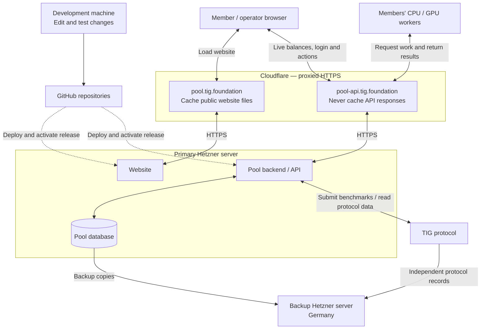

# Pool structure

This shows the agreed live setup following the website/API split on
25 September 2026. Cloudflare proxies both addresses; the website and backend
run on the same primary Hetzner server. The code is implemented and tested;
public HTTPS activation still awaits the Cloudflare exception and certificates
listed in the [setup checklist](CLOUDFLARE_SETUP.md).

- **Two addresses, one primary server.** Both DNS records use **Proxied**
  (orange cloud), with HTTPS on both connections. Daniel reports that
  **Full (strict)** is already selected; the server certificates and effective
  settings for both hostnames still need verification.
- **Cache public website files; keep live data uncached.** The browser loads
  the website from `pool.tig.foundation`, then calls
  `pool-api.tig.foundation/api/v2` for login, balances and actions. Workers use
  that same API address for their work. Member and operator permissions remain
  distinct from worker permissions. API traffic must not receive browser
  challenge pages.
- **Updates become live after deployment and activation.** Saving changes to
  GitHub alone doesn't update the website. Public CSS/JavaScript now use
  content-hashed URLs and can be cached for a year; HTML and all API responses
  use `no-store`. Deployment retains older public asset hashes so pages already
  open can finish loading. Keep temporary website cache bypass until public
  routing and caching are verified.
- **The backend talks directly to TIG.** Outgoing protocol connections and
  backup transfers do not pass through the website's Cloudflare proxy.
- **Backup takeover is manual.** The German server preserves recovery data until
  needed. Recovery includes switching Cloudflare's origin to the backup after
  stopping the old primary and verifying the restored pool.

The existing API version remains `/api/v2`; the hostname split does not require
renaming it to `/api/v1` or creating a second backend.

The diagram describes the target setup, not a completed mainnet launch. See
[Cloudflare setup and next steps](CLOUDFLARE_SETUP.md) for the operator checklist.

To preview this Markdown file in VS Code, press **Ctrl+Shift+V**
(**Cmd+Shift+V** on Mac). To open the preview beside the source, press
**Ctrl+K**, then **V** (**Cmd+K**, then **V** on Mac).
