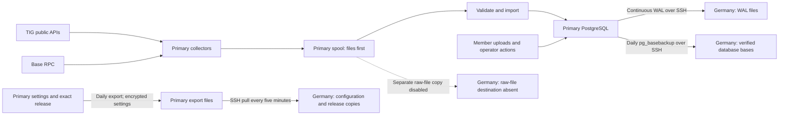

# Pool data and its path to recovery

Read-only trace of the running primary and recovery hosts on **9 October 2026,
14:55 UTC**, plus the code in the installed pool release `8477509` and pinned
worker `fd29279`. No runtime settings, retention policy or financial/protocol
records were changed by this trace. Connection settings were also read from
the actual service DSNs during the follow-up.

## Data sources and contents

| Data | Source | What the pool stores and why |
|---|---|---|
| Member identity and access | Member wallet login and execution-token issuance | Wallet addresses, withdrawal destination, collateral multiplier and revision history, login challenge messages and their use/expiry, token digests and revocation. The token table stores hashes. |
| Money and member obligations | Pool transactions and verified chain receipts | Account balances, append-only journals and entries, deposit attribution, collateral holds and outcomes, withdrawal reviews/attempts/payments, operator funding and audit events. These establish ownership of TIG held in the shared wallet. |
| Work ownership and submissions | Member requests, coordinator and worker uploads | Immutable selections, exact assignment JSON/digest, benchmark owner, confirmed acknowledgment time, results, sampled nonces, proofs, submission intents, send timestamps and TIG response evidence. These prevent duplicate sends and establish responsibility. |
| Algorithm binaries | TIG's public binary download, including its permitted artifact redirects | The exact compressed archive and SHA-256 in `algorithm_archives`, linked to the reservation; members download that saved copy. |
| TIG network history | Public `/get-block`, `/get-challenges`, `/get-algorithms`, `/get-opow`, `/get-benchmarks` | Block/configuration data, all active players' benchmark feeds and the pool's pending feed, captured between two reads of the same head. Used for selection, exact qualifying credit and outcome reconciliation. |
| Reports and arbitration | Public `/get-reports`, `/get-reportable-benchmark-ids` | Round report responses, reportable benchmark indices, confirmed reports/arbitrations, reporting-round associations and final evidence seals. Used for collateral and settlement. |
| Base wallet evidence | Configured read-only Base RPC | Block anchors, finalized transfer logs, receipts/transactions and TIG/native balance checks, with collection cursors and failure evidence. Used for verified receipts, withdrawals and wallet reconciliation. |
| TIG submission-credit evidence | Public `/get-player-data`, bracketed by `/get-block` | Pool fee balance, top-up facts and captured top-up configuration. Used to reconcile operator-paid protocol credit. |
| Credit and settlement | Pool calculations over validated observations | Per-block member benchmark credit, coverage markers, earnings/receipt/reimbursement attribution, collateral finalizations and round allocations. Implemented settlement tables may be empty while settlement is disabled. |
| Operational controls | Operator and maintenance services | Work pause, multiplier/pilot controls, schema migration checksums, retention floors/runs and coverage/conflict alerts. |

The block collector reads the **whole active TIG network** for every new head,
even with new pool work paused. Reports currently cover the latest four rounds,
with indices for the pool player across challenges `c001` through `c008`.
It saves partial/failed attempts too, but only complete validated observations
can supply accounting evidence. Custody failures can therefore occupy storage
without supplying a fresh wallet reconciliation.

Member login, uploads and operator actions enter PostgreSQL directly through
the API. Collector data takes the separate file-spool path below.

## What happens to a captured response

Each collector writes a compressed JSON manifest and its content chunks to
local disk **before database import**. File data and directory changes are
flushed, and the manifest is published atomically. The manifest references
chunks by SHA-256; unchanged records reuse chunks. Block record lists also use
deduplicated pages of hashes. This preserves replayable JSON semantics, rather
than every byte of the original HTTP encoding.

The spool has `pending/`, `recorded/` and `chunks/` directories. A separate
recorder validates the capture, commits it to PostgreSQL, then moves its
manifest from pending to recorded. Block manifests and compressed chunks are
also stored in the database; reports, custody and funding keep their capture
payloads and parsed facts there. Thus imported evidence normally exists in
both stores. Database observations also support recorded gaps, conflicts and
incomplete attempts without treating them as valid financial evidence.

`recorded` means the recorder processed the file, not that its contents were
complete. In particular, a failed report attempt with no starting block can be
archived as recorded without a database capture row. The report database keeps
the report response plus abridged block provenance and links to the independent
block archive, rather than reproducing every redundant field of the spool file.

Balances are updated through journal entries. Transaction locks, uniqueness
checks and immutable-record guards keep ownership, charges and credit from
being duplicated or silently rewritten. Large protocol history is the main
storage consumer.

## Exactly how Germany receives the data

### Continuous WAL

PostgreSQL writes a recovery log called **write-ahead log (WAL)**. Germany's
`pg_receivewal` receives that stream over a restricted SSH tunnel and saves it
as files. The tunnel connects to the primary's loopback PostgreSQL port using
a dedicated replication-only database role. Host keys are pinned.

The receiver flushes received bytes to disk and acknowledges them. **All six
current primary services use `innopool_runtime` with synchronous commits**,
so API/coordinator writes and collector database imports wait for that disk
acknowledgment. The configured local-commit observer role is currently unused
by these services. File capture can continue while database recording waits.
The live receiver was streaming, synchronous and zero bytes behind at the
survey instant. This is a measurement, not a permanent freshness guarantee.

WAL contains database changes, including imported evidence. External spool
files, application files and worker files are outside that stream.
See PostgreSQL's [WAL introduction](https://www.postgresql.org/docs/18/wal-intro.html)
and [pg_receivewal](https://www.postgresql.org/docs/18/app-pgreceivewal.html).

### Daily database bases

Around **03:10 UTC**, with up to five minutes of randomized delay, Germany
runs `pg_basebackup` against the primary over that tunnel. It creates a physical
backup of the **whole PostgreSQL cluster**, including auxiliary databases and
database roles, while the primary remains online. It stores `base.tar.gz`,
the WAL required for the backup's consistency, a manifest and verification
record. Checksums and the required WAL range are checked before publication.

Three verified bases are retained, with subsequent WAL back to the oldest
retained base. A successful new base permits pruning older redundant bases
and earlier WAL on the same timeline. A restored base plus later WAL
reconstructs newer committed database state. Germany stores recovery files;
takeover requires restoration and WAL replay before starting the pool there.
See [pg_basebackup](https://www.postgresql.org/docs/18/app-pgbasebackup.html).

The current base completed **9 October, 03:42 UTC**, with checksum/WAL checks
passed. The last actual isolated restoration and post-backup WAL replay check
was **4 October**. Today's checksum checks are not a new restore rehearsal.

### Settings and application

Around **02:30 UTC**, with up to two minutes of randomized delay, the primary
exports service settings, credentials, TLS material, systemd/nginx configuration
and operational helpers into an **encrypted settings archive**. The export also
includes the exact deployed application source, release record and retained
public website assets. Exported-file hashes are recorded.

Germany pulls published exports with `rsync` over restricted read-only SSH
every five minutes. The current release/settings export is from **14:29 UTC**;
all its file hashes were verified on Germany. Copying settings does not advance
the database recovery point. The database-base and WAL jobs do not themselves
encrypt their output files; SSH protects their transport, and access to the
stored files is restricted. Settings receive the additional archive encryption.

### Separate raw evidence files

The installed full-spool copy would copy **blocks and reports** using a separate
read-only SSH/rsync job. Its timer is disabled after the 8 October disk-reserve
failure; its destination `primary-evidence/` was absent in this survey.
It does not provide current protection for pending files, and its implementation
does not copy custody/funding spools. Germany's independent block/report
collectors and pool API are inactive; its local spool measured only 36 KiB.

A future pending-file copy must include manifests **and all referenced chunks**
and explicitly cover each required capture type. The proposed copy is not
installed. Re-enabling the old full-spool job is a separate storage decision.

## Paths and measured size

Sizes are allocated binary GiB at the survey instant. The database table sizes
include indexes and large-value storage. They are not all live payload bytes.

| Host | Path / contents | GiB |
|---|---|---:|
| Primary | `postgres/` under `/var/lib/innopool-v2-mainnet` | 27.1 |
| Primary | Main `innopool_v2_mainnet` database, within that cluster | 26.7 |
| Primary | `spool/blocks` | 21.4 |
| Primary | `spool/reports` | 2.1 |
| Primary | `spool/custody` | 0.2 |
| Primary | `spool/funding` | 2.0 |
| Primary | `/var/lib/innopool-v2-mainnet-backups`, including configuration/manual exports | 2.9 |
| Recovery | `primary-continuous/base` under `/var/lib/innopool-v2-mainnet` | 38.6 |
| Recovery | `primary-continuous/wal` | 51.1 |
| Recovery | `primary-backups`, including copied configuration/manual exports | 2.9 |

Primary free space was **83.1 GiB** and recovery free space **45.0 GiB**.
The primary's four pending import queues were all empty in this sample.

The largest database tables were:

| Table | Content | GiB |
|---|---|---:|
| `capture_attempts` | Block-capture manifests, request metadata and failed-attempt records | 18.5 |
| `observation_chunks` | Deduplicated compressed block evidence | 2.9 |
| `funding_captures` | TIG fee-balance/top-up snapshots | 2.0 |
| `report_index_captures` | Repeated reporting-round/player/challenge index captures | 1.9 |

Continuous WAL records writes across time, including index and page changes,
so its retained size can exceed one current database. Compressed bases and
compressed evidence chunks have different size characteristics.

## Retention and recovery limits

The agreed policy preserves ledger, member benchmark ownership, collateral,
credit and settlement records permanently. Raw block/report evidence is bounded
to four rounds subject to obligation, coverage and verified-backup guards;
custody/funding captures are bounded to thirty days. Expiry keeps identifiers
and hashes while removing eligible payloads. Local file pruning currently covers
the **block spool**; report/custody/funding spool files have no equivalent pruning.
The latest daily retention run expired some report/index payloads and removed
no block manifests or chunks. See [evidence retention](EVIDENCE_RETENTION.md).

PostgreSQL can reuse space freed by expiry. Returning all of that allocated
space to the operating system requires separate maintenance; it is not an
automatic consequence of clearing a payload. See
[routine vacuuming](https://www.postgresql.org/docs/18/routine-vacuuming.html).

Three different losses have different consequences:

- A primary loss after protected database commit can be recovered from a
  verified base and the required WAL, together with the exact release/settings.
- A primary loss before a new spool capture enters the database can lose that
  file because its separate off-host copy is disabled. An empty queue now does
  not remove this future interval.
- A TIG block that was never captured cannot be reconstructed from either
  backup path. The existing block gaps are collection gaps.

Workers separately retain exact assignments and every computed nonce's full
solution leaf/quality in local `member-worker.sqlite3`, plus runtime/cache files.
The pool receives all nonce qualities and a Merkle root, followed by sampled
solution proofs; it does not receive all nonce solutions. Server backups do
not cover member machines. Host service/web logs and the development workspace
also have no blanket coverage through these pool backup streams.
